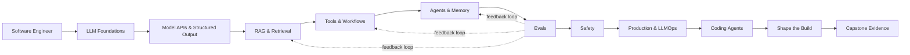

# Practical AI Engineering Roadmap

[](ROADMAP.md)
[](.github/workflows/validate.yml)
[](LICENSE)
[](CONTRIBUTING.md)

**A project-based, eval-driven path from software engineer to Applied AI Engineer.**

[English](README.md) · [简体中文](README.zh-CN.md) · [12-week roadmap](ROADMAP.md) · [Capstone](capstone/README.md)

> Not another link dump. Every stage follows **Learn → Build → Prove → Explain**.

## Follow the path

1. **[Follow-along study guide](STUDY_GUIDE.md)**: assigned reading, minimum build and exit checks for every week.
2. **[Interview preparation](interview/README.md)**: weekly prompts, answer checkpoints, coding/system-design drills and a four-week sprint.

The 12 weeks are reference stages; allow 16–20 calendar weeks at eight hours per week. Five offline labs cover validation, retrieval, tools, recovery and evaluation; production integration remains a capstone assignment.

## Why this exists

AI engineering is not just prompt writing or calling a model API. Production systems combine software engineering, model behavior, retrieval, tools, evaluations, safety, observability, and product judgment.

This repository turns those skills into a practical learning system for developers who already know how to build software and want to become effective **Applied AI Engineers / AI Product Engineers**.

It is independently written and inspired by [Andrew Ng's AI Engineering Skills Map](https://www.andrewng.org/writing). It is **not affiliated with Andrew Ng, DeepLearning.AI, or Stanford University**.

## Who this is for

This roadmap is designed for people who:

- can already build and ship software;
- know at least one backend or full-stack language;
- want to build reliable AI products rather than train frontier foundation models;
- prefer projects, measurable evidence, and engineering trade-offs over certificate collecting.

Beginners can still use the roadmap, but should complete the [optional foundations track](docs/skill-matrix.md#optional-foundations-track) first.

## What you will build

A single capstone evolves throughout the roadmap:

> **AI SaaS Support & Product Operations Agent** — a system that retrieves product knowledge, calls read-only tools, analyzes evidence, drafts GitHub issues, and performs approved actions with evaluations, safety controls, tracing, latency, and cost tracking.



## The evidence-first learning loop

Every module uses the same four-part contract:

| Step | Question | Example |
|---|---|---|
| **Learn** | What concepts and trade-offs matter? | Hybrid retrieval, reranking, context assembly |
| **Build** | What working system proves understanding? | A cited knowledge assistant |
| **Prove** | What metric or test shows it works? | Recall@5, citation accuracy, p95 latency |
| **Explain** | Can you defend the design? | Why hybrid search instead of vector-only? |

Our evidence ladder is:

> **production telemetry > controlled evals > staged tests > demos > claims**

## 12-week path

| Week | Focus | Build | Prove |
|---:|---|---|---|
| 0 | Orientation and baseline | Project spec + 20 eval cases | Clear scope and acceptance criteria |
| 1 | LLM foundations | Token/cost explorer | Explain generation, context, and failure modes |
| 2 | Model APIs | Typed model gateway | Schema validity, retries, latency, cost |
| 3 | RAG foundations | Cited document assistant | Recall@k and citation correctness |
| 4 | Retrieval improvement | Hybrid search + reranking | Measured lift over baseline |
| 5 | Tools and workflows | Tool registry + deterministic flow | Tool-selection and argument accuracy |
| 6 | Agents and memory | Stateful agent with approval | Task success and recovery tests |
| 7 | Evals | Golden dataset + eval runner | Regression report and error taxonomy |
| 8 | Safety | Permission model + red-team set | Zero unauthorized write actions |
| 9 | Production | Tracing, budgets, fallbacks | p95 latency, cost, reliability |
| 10 | Coding agents | Sandboxed patch workflow | Patch success and test-pass rate |
| 11 | Shape the build | Product/architecture decisions | Evidence-backed scope decisions |
| 12 | Capstone | Public demo + technical report | Reproducible portfolio evidence |

See the generated [full roadmap](ROADMAP.md) and the machine-readable [roadmap.yaml](roadmap.yaml).

## Start here

Requires Python 3.11+; Python 3.12 is recommended.

```bash
git clone https://github.com/CJianYu/practical-ai-engineering-roadmap.git
cd practical-ai-engineering-roadmap
python -m venv .venv
source .venv/bin/activate        # Windows: .venv\Scripts\activate
pip install -r requirements-dev.txt
make validate
```

Then:

1. Complete the [orientation module](curriculum/00-orientation/README.md).
2. Copy the [progress tracker](templates/progress-tracker.md).
3. Run [Lab 01: Structured Output](labs/lab01_structured_output/README.md).
4. Choose a real product or domain for your capstone.
5. Publish one measurable artifact every week.

## Curriculum

| Module | Main outcome |
|---|---|
| [00 — Orientation](curriculum/00-orientation/README.md) | Scope the transition and establish a baseline |
| [01 — LLM Foundations](curriculum/01-llm-foundations/README.md) | Build a useful mental model of LLM behavior |
| [02 — Model APIs](curriculum/02-model-apis/README.md) | Build robust structured model calls |
| [03 — RAG](curriculum/03-rag/README.md) | Ground responses in retrievable evidence |
| [04 — Tools & Workflows](curriculum/04-tools-and-workflows/README.md) | Connect models to reliable actions |
| [05 — Agents & Memory](curriculum/05-agents-and-memory/README.md) | Build stateful, recoverable agent systems |
| [06 — Evals](curriculum/06-evals/README.md) | Improve systems through measurable feedback |
| [07 — Safety](curriculum/07-safety/README.md) | Control permissions and adversarial inputs |
| [08 — Production](curriculum/08-production/README.md) | Operate AI systems under real constraints |
| [09 — Coding Agents](curriculum/09-coding-agents/README.md) | Use sandboxes, tests, and review gates |
| [10 — Shape the Build](curriculum/10-shaping-the-build/README.md) | Turn ambiguous needs into verifiable systems |

## Runnable labs

- [Lab 01 — Structured Output](labs/lab01_structured_output/README.md): validate nondeterministic model output behind a typed boundary.
- [Lab 02 — Eval-driven RAG](labs/lab02_rag_evals/README.md): implement retrieval and measure Recall@k and MRR before adding generation.

- [Lab 03 — Tool Calling, Approval and Idempotency](labs/lab03_tool_calling/README.md): offline exercise for Week 5.
- [Lab 04 — Agent State, Checkpoints and Recovery](labs/lab04_agent_state/README.md): offline exercise for Week 6.
- [Lab 05 — Agent Evaluation and Regression Gates](labs/lab05_agent_evals/README.md): offline exercise for Week 7.

[All labs](labs/README.md) · [中文实验说明](labs/lab03_tool_calling/README.zh-CN.md)

The labs intentionally start framework-light. You should understand the loop before outsourcing it to an abstraction.

## Capstone deliverables

A completed capstone should include:

- a deployable service and public demo;
- an architecture diagram and decision records;
- 50–100 representative evaluation cases;
- deterministic graders plus calibrated LLM judges where appropriate;
- an error taxonomy and before/after experiments;
- cost, latency, and reliability metrics;
- a threat model, permission policy, and red-team cases;
- a 3–5 minute English walkthrough;
- quantified résumé bullets based on real results.

Read the complete [capstone specification](capstone/README.md).

## Principles

1. **Evals are the spine.** Do not optimize what you cannot measure.
2. **Prefer workflows before agents.** Add autonomy only when it earns its complexity.
3. **Use deterministic code whenever possible.** Reserve model judgment for genuinely fuzzy tasks.
4. **Build one system deeply.** Ten disconnected demos are weaker than one evaluated product.
5. **Treat untrusted content as untrusted.** Retrieved text and tool output can contain adversarial instructions.
6. **Track quality, cost, latency, and safety together.** A benchmark score alone is not a product.
7. **Write down trade-offs.** Engineering judgment is part of the portfolio.

## Recommended anchor courses

This repository is a learning path, not a replacement for excellent teachers. Useful anchors include:

- [Andrew Ng — AI Engineering Skills Map](https://www.andrewng.org/writing)
- [Stanford CS329Z — Engineering AI Agents](https://cs329z.stanford.edu/)
- [DeepLearning.AI — Agentic AI](https://www.deeplearning.ai/courses/agentic-ai)
- [DeepLearning.AI — Retrieval Augmented Generation](https://www.deeplearning.ai/courses/retrieval-augmented-generation)
- [CMU — Machine Learning in Production](https://mlip-cmu.github.io/)

See the annotated [resource guide](resources/README.md) for how and when to use each resource.

## Repository structure

```text
.
├── curriculum/       # Learn / Build / Prove / Explain modules
├── labs/             # Runnable, tested exercises
├── capstone/         # End-to-end project specification
├── templates/        # Evals, error analysis, ADRs, progress tracking
├── docs/             # Skill matrix, philosophy, FAQ, maintainer guide
├── resources/        # Curated primary and official resources
├── scripts/          # Roadmap validation and rendering
├── roadmap.yaml      # Machine-readable source of truth
└── ROADMAP.md        # Generated human-readable roadmap
```

## Contributing

High-signal contributions are welcome, especially:

- runnable labs with tests;
- evaluation datasets and graders;
- production postmortems and measurable case studies;
- translations;
- corrections to outdated resources;
- narrowly scoped improvements to one module.

Please read [CONTRIBUTING.md](CONTRIBUTING.md). Resource suggestions must explain **what the learner should use the resource for**, not merely add another link.

## Roadmap status

**v0.1.0** includes the complete 12-week path, two runnable labs, templates, and a capstone specification. The current main branch additionally includes tool approval, agent recovery and regression-evaluation labs. Safety and observability extensions remain planned.

See [CHANGELOG.md](CHANGELOG.md).

## Support the project

If this roadmap helps you, star the repository, share what you built, and open an issue with your results. Real learner evidence is more valuable than another bookmark list.

## License

MIT. See [LICENSE](LICENSE).
