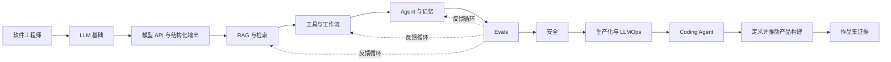

# 实用 AI 工程师学习路线

[](ROADMAP.md)
[](labs/)
[](LICENSE)

**面向软件工程师的项目制、评测驱动 AI Engineering 路线。**

[English](README.md) · [简体中文](README.zh-CN.md) · [12 周路线](ROADMAP.md) · [毕业项目](capstone/README.md)

> 这不是课程链接收藏夹。每一阶段都遵循：**学习 → 构建 → 证明 → 讲清楚**。

## 从这里照着学

1. **[按周学习指南](STUDY_GUIDE.zh-CN.md)**：每周先看什么、做什么、做到哪里可以继续。
2. **[面试准备与资源](interview/README.zh-CN.md)**：对应每周的练习题、答题要点、编程/系统设计与四周冲刺。

12 周是参考阶段；每周 8 小时时可按 16–20 周完成。当前有两个入门 Lab，其余阶段是 Capstone 实践任务。

## 为什么做这个项目

AI 工程并不只是写 Prompt 或调用模型 API。真实系统需要同时处理：软件工程、模型不确定性、数据检索、工具调用、评测、安全、可观测性、成本和产品判断。

这个仓库面向已经会开发软件、希望转型为 **Applied AI Engineer / AI Product Engineer** 的工程师，把抽象技能拆成一条可以执行、可以验收、可以写进作品集的路线。

本项目受 [吴恩达 AI Engineering Skills Map](https://www.andrewng.org/writing) 启发，但内容为独立编写，**与吴恩达、DeepLearning.AI、Stanford University 无官方关联**。

## 适合谁

- 已经掌握至少一种后端或全栈开发语言；
- 能独立完成普通 Web 服务和部署；
- 目标是构建可靠 AI 产品，而不是短期内训练基础大模型；
- 喜欢项目、数据和工程取舍，不想只刷证书。

零基础学习者也可以使用，但建议先完成 [可选基础轨道](docs/skill-matrix.md#optional-foundations-track)。

## 你最终会做出什么

一条主线项目贯穿 12 周：

> **AI SaaS 客服与产品运营 Agent**：检索产品知识、调用只读工具、基于证据分析问题、起草 GitHub Issue，并在人工批准后执行受控操作；同时具备评测、安全、Tracing、延迟和成本指标。



## 学习闭环

| 阶段 | 要回答的问题 | 示例 |
|---|---|---|
| **Learn** | 需要理解哪些概念和取舍？ | 混合检索、重排、Context 组装 |
| **Build** | 用什么系统证明理解？ | 带原文引用的知识问答系统 |
| **Prove** | 用什么指标证明有效？ | Recall@5、引用正确率、p95 延迟 |
| **Explain** | 能否解释自己的设计？ | 为什么不用纯向量检索？ |

证据优先级：

> **线上数据 > 受控评测 > 分阶段测试 > Demo > 口头宣称**

## 12 周简表

| 周 | 主题 | 产出 | 验收 |
|---:|---|---|---|
| 0 | 定位与基线 | 项目 Spec + 20 条评测题 | 范围和验收标准明确 |
| 1 | LLM 基础 | Token/成本实验 | 能解释生成机制和失败模式 |
| 2 | 模型 API | 类型安全模型网关 | Schema、重试、延迟、成本 |
| 3 | RAG 基础 | 带引用的文档助手 | Recall@k、引用正确率 |
| 4 | 检索优化 | Hybrid Search + Reranking | 相比基线有可测提升 |
| 5 | 工具与工作流 | Tool Registry + Workflow | 工具选择及参数准确率 |
| 6 | Agent 与 Memory | 可恢复、可审批的 Agent | 任务成功率和恢复测试 |
| 7 | Evals | Golden Dataset + Eval Runner | 回归报告和错误分类 |
| 8 | 安全 | 权限模型 + 红队测试集 | 未授权写操作为 0 |
| 9 | 生产化 | Tracing、预算、Fallback | p95、成本、可靠性 |
| 10 | Coding Agent | 沙箱代码修改流程 | Patch 成功率与测试通过率 |
| 11 | Shape the Build | 产品与架构决策 | 用证据决定范围 |
| 12 | Capstone | Demo + 技术报告 | 可复现的作品集证据 |

完整内容见 [ROADMAP.md](ROADMAP.md)，机器可读版本见 [roadmap.yaml](roadmap.yaml)。

## 如何开始

```bash
git clone https://github.com/CJianYu/practical-ai-engineering-roadmap.git
cd practical-ai-engineering-roadmap
python -m venv .venv
source .venv/bin/activate        # Windows: .venv\Scripts\activate
pip install -r requirements-dev.txt
make validate
```

然后：

1. 完成 [00 — Orientation](curriculum/00-orientation/README.md)；
2. 复制 [学习进度模板](templates/progress-tracker.md)；
3. 运行 [Lab 01 — Structured Output](labs/lab01_structured_output/README.md)；
4. 为自己的 Capstone 选一个真实产品或业务领域；
5. 每周发布一个可运行、可量化的成果。

## 课程模块

| 模块 | 目标 |
|---|---|
| [00 — 定位](curriculum/00-orientation/README.md) | 确定转型范围并建立基线 |
| [01 — LLM 基础](curriculum/01-llm-foundations/README.md) | 建立够用的模型心智模型 |
| [02 — 模型 API](curriculum/02-model-apis/README.md) | 稳定调用模型并验证输出 |
| [03 — RAG](curriculum/03-rag/README.md) | 用可检索证据约束回答 |
| [04 — 工具与工作流](curriculum/04-tools-and-workflows/README.md) | 让模型可靠连接真实操作 |
| [05 — Agent 与 Memory](curriculum/05-agents-and-memory/README.md) | 构建有状态、可恢复系统 |
| [06 — Evals](curriculum/06-evals/README.md) | 用评测和错误分析持续改进 |
| [07 — 安全](curriculum/07-safety/README.md) | 管理权限和不可信内容 |
| [08 — 生产化](curriculum/08-production/README.md) | 在真实约束下运行系统 |
| [09 — Coding Agent](curriculum/09-coding-agents/README.md) | 通过沙箱、测试和审核控制代码 Agent |
| [10 — Shape the Build](curriculum/10-shaping-the-build/README.md) | 把模糊需求转成可验证系统 |

## 核心原则

1. **Evals 是主线**：无法测量，就无法持续优化。
2. **先 Workflow，后 Agent**：自治能力必须证明值得它带来的复杂度。
3. **能用确定性代码就不用模型猜**。
4. **深入做一个真实系统，而不是堆十个玩具 Demo**。
5. **检索内容和工具输出都属于不可信输入**。
6. **质量、成本、延迟和安全必须同时衡量**。
7. **记录取舍**：工程判断本身就是作品集的一部分。

## 推荐主线课程

- [吴恩达 — AI Engineering Skills Map](https://www.andrewng.org/writing)
- [Stanford CS329Z — Engineering AI Agents](https://cs329z.stanford.edu/)
- [DeepLearning.AI — Agentic AI](https://www.deeplearning.ai/courses/agentic-ai)
- [DeepLearning.AI — Retrieval Augmented Generation](https://www.deeplearning.ai/courses/retrieval-augmented-generation)
- [CMU — Machine Learning in Production](https://mlip-cmu.github.io/)

什么时候学、学到什么程度，见 [资源说明](resources/README.md)。

## 贡献

欢迎以下高质量贡献：

- 有测试的可运行 Lab；
- 评测数据集和 Grader；
- 生产事故复盘和量化案例；
- 翻译；
- 过期链接修正；
- 针对单个模块的小而清晰的改进。

请先阅读 [CONTRIBUTING.md](CONTRIBUTING.md)。新增资源时必须说明它具体解决什么学习问题，不能只追加链接。

## 项目状态

**v0.1.0** 已包含完整 12 周路线、两个可运行 Lab、模板和 Capstone Spec。后续将继续增加工具调用、Agent Harness、安全和可观测性实验。

## 支持项目

觉得有帮助，可以给仓库一个 Star，并分享你依据路线做出的真实项目和评测结果。真实学习证据比另一份收藏夹更有价值。

## License

MIT，见 [LICENSE](LICENSE)。
