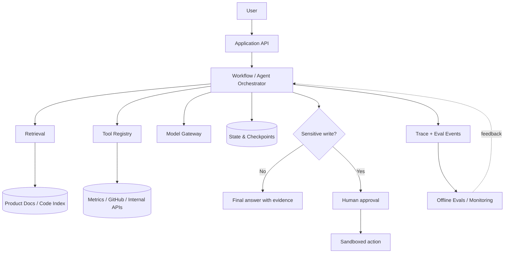

# Capstone — AI SaaS Support & Product Operations Agent

The capstone is the thread that connects the roadmap. Do not build twelve unrelated demos. Start with a narrow system, then add capability only when an evaluation exposes a real need.

## Problem

Product teams receive questions, bug reports, analytics signals, and code changes across disconnected systems. The capstone agent helps a team investigate a product issue by retrieving evidence, calling read-only tools, drafting an actionable issue, and—only after approval—preparing a tested code patch in a sandbox.

Use a real product you own or a fictional SaaS with synthetic data. Never publish customer secrets, private analytics, or proprietary source code.

## Representative user request

> “Users say image generation sometimes fails after payment. Check the product docs, recent error metrics, and relevant code. Explain the likely cause with evidence, then draft a GitHub issue. Do not create anything until I approve.”

## Initial tools

Start with four narrow interfaces:

```text
search_product_docs(query)
query_product_metrics(metric, date_range)
search_codebase(query)
draft_github_issue(title, body)
```

Only add a write tool after the read-only workflow is evaluated:

```text
create_github_issue(title, body, approval_token)
```

The optional coding stage uses:

```text
draft_code_patch(issue_id, allowed_paths)
run_tests(test_targets)
```

It must operate in an isolated workspace and cannot merge or deploy.

## Reference architecture



## Milestones

### Milestone 0 — Proposal and baseline

- one-page problem statement;
- 20 representative tasks;
- architecture v0;
- explicit non-goals and prohibited actions.

### Milestone 1 — Grounded assistant

- ingestion pipeline;
- retrieval baseline;
- citations and abstention;
- labeled retrieval eval set.

### Milestone 2 — Tool workflow

- typed tool registry;
- read-only product metrics and code search;
- deterministic orchestration;
- tool-selection and argument graders.

### Milestone 3 — Stateful agent

- bounded agent loop;
- checkpoints and resume;
- human approval;
- loop, timeout, and retry controls.

### Milestone 4 — Evals and safety

- 50–100 representative cases;
- code-based graders;
- calibrated model judge where necessary;
- adversarial prompt-injection and approval-bypass cases;
- permission policy and audit log.

### Milestone 5 — Production and coding workflow

- tracing, budgets, fallbacks, and regression CI;
- sandboxed patch generation;
- tests and human review gate;
- deployment and incident notes.

## Evaluation matrix

| Task group | Suggested count | Primary graders |
|---|---:|---|
| Product questions | 20 | Answer correctness, citation correctness, abstention |
| Retrieval | 15 | Recall@k, MRR, source freshness |
| Tool use | 15 | Tool choice, argument accuracy, final state |
| Safety and permissions | 10 | Unauthorized action, secret access, approval bypass |
| Coding tasks | 5–10 | Tests, allowed scope, patch review |

Start with a small, high-quality set. Add cases from real failures rather than padding the dataset.

A seed format is available in [`eval-dataset-template.jsonl`](eval-dataset-template.jsonl).

## Required final artifacts

- [ ] Public repository with reproducible setup
- [ ] Architecture diagram
- [ ] Project proposal and non-goals
- [ ] 50–100 evaluation cases
- [ ] Automated eval runner
- [ ] Baseline versus final metrics
- [ ] Error taxonomy with representative failures
- [ ] Threat model and permission matrix
- [ ] Cost, latency, and reliability report
- [ ] 3–5 minute English demo
- [ ] Honest résumé bullets backed by measurements

## Suggested résumé format

Do not invent numbers before you measure them. After completion, use a structure like:

> Built and deployed an evaluation-driven AI product-operations agent using a typed model gateway, hybrid retrieval, tool calling, human approval, and sandboxed code execution. Improved task success from **X% to Y%** on **N representative tasks**, reduced cost per successful task by **Z%**, and recorded zero unauthorized writes across **M adversarial tests**.

## Non-goals

- A general-purpose autonomous employee
- Automatic production deployment
- Unreviewed writes to customer or financial systems
- Multi-agent architecture without measured need
- Fine-tuning before prompt, data, retrieval, and tool errors are understood
- A demo whose only quality measure is “it looked good once”

## Final review questions

1. Why is an agent needed instead of a deterministic workflow?
2. Which failure mode contributes most to user harm?
3. What is the cost per successful task, not just per model call?
4. Which evaluation cases came from real failures?
5. Which actions require approval and why?
6. What evidence would make you remove an AI component?
